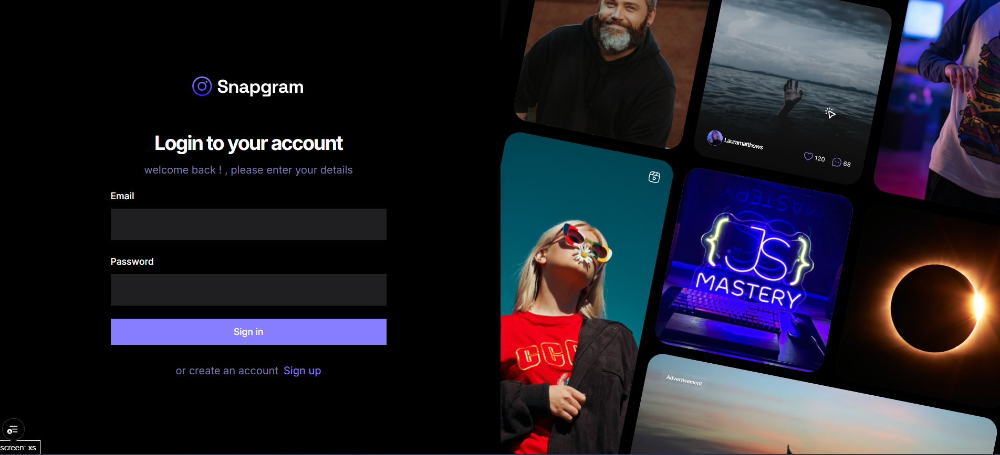

# Social App — Instagram-like Clone

A modern Instagram-like single-page application (SPA) built with React, TypeScript, Vite and Appwrite as the backend platform. This project is a small social media clone, intended as a learning / demo application with features such as authentication, posts with images, likes, saves, profiles and basic search/explore functionality.

 

## Key Features

- Email/password authentication (via Appwrite)
- Create, edit and delete posts with image uploads
- Follow / unfollow and view user profiles
- Like and save posts
- Explore feed and search results
- Responsive UI built with Tailwind CSS
- Client-side data fetching and mutations using React Query

## Tech Stack

- Frontend: React 19, TypeScript, Vite
- Styling: Tailwind CSS (+ plugins)
- State & Data: @tanstack/react-query
- Form validation: react-hook-form + zod
- File storage / Auth / Database: Appwrite SDK
- Notifications: sonner / react-toastify

## Repository Structure (high level)

- `src/`
  - `_auth/` — authentication layout & sign-in / sign-up forms
  - `_root/` — app root layout and pages (Home, Explore, Profile, PostDetails, Create/Edit Post, etc.)
  - `components/` — reusable UI components (forms, post cards, sidebars, loaders, etc.)
  - `lib/` — utilities, Appwrite client config, react-query provider, validation logic
  - `context/` — AuthContext and other React contexts
  - `hooks/` — custom hooks (e.g., useDebounce)
  - `types/` — shared TypeScript types

Other top-level files:

- `vite.config.ts`, `tsconfig.json`, `package.json` — project tooling and scripts
- `globals.css` — global styles and Tailwind base

> Note: This summary is intentionally concise. Inspect `src/` for component-level details.

## Environment variables

This app uses Vite environment variables (prefixed with `VITE_`) to configure Appwrite and other environment-specific values. Create a `.env` file at the project root with the variables below (replace values with your Appwrite project details):

```
VITE_APPWRITE_URL=
VITE_APPWRITE_PROJECT_ID=
VITE_APPWRITE_DATABASE_ID=
VITE_APPWRITE_SRORAGE_ID=
VITE_APPWRITE_USERS_COLLECTION_ID=
VITE_APPWRITE_POSTS_COLLECTION_ID=
VITE_APPWRITE_SAVES_COLLECTION_ID=
```

Important: The project currently reads `VITE_APPWRITE_SRORAGE_ID` (note the typo "SRORAGE") from `src/lib/appwrite/config.ts`. If you prefer a corrected variable name (`VITE_APPWRITE_STORAGE_ID`), update the code accordingly — otherwise keep the variable name as-is in your `.env` file.

### Appwrite notes

- You must create a project in Appwrite and create the databases/collections used by the app (users, posts, saves). Make sure the collection IDs and database ID match the env variables.
- Configure Appwrite storage buckets for post images and set appropriate permissions for uploads.

## Getting started (development)

Prerequisites:

- Node.js (recommended v18+)
- npm, pnpm or yarn

Install dependencies:

```bash
npm install
# or
pnpm install
```

Run the dev server:

```bash
npm run dev
# or
pnpm dev
```

Open the app in your browser (Vite will print the local URL, e.g. `http://localhost:5173`).

Available npm scripts (from `package.json`):

- `dev` — start the Vite development server
- `build` — run TypeScript build and create a Vite production build
- `preview` — locally preview the production build
- `lint` — run ESLint across the project

## Build and deployment

1. Ensure all environment variables are set for production (Vite supports `.env.production` or CI-defined envs).
2. Run `npm run build` to produce a production-ready bundle in `dist/`.
3. Deploy `dist/` to a static host (Netlify, Vercel, GitHub Pages, S3 + CloudFront, etc.) or a container depending on your infrastructure.

If you rely on Appwrite, be sure the Appwrite instance is reachable from your deployed frontend (CORS and endpoints configured correctly).

## Development tips

- Use React Query Devtools (you can add it temporarily) to inspect queries and cache behavior.
- Tailwind's JIT and class scanning are enabled by Vite + Tailwind config — if you add classes dynamically, ensure they are discoverable for purging.
- When changing Appwrite collection schemas, update the corresponding TypeScript types in `src/types` and any query/mutation code in `src/lib/react-quary/quriesAndMutations.ts`.

## Testing

This repository does not currently include automated test suites. Suggested next steps:

- Add unit tests with Vitest or Jest for critical utilities and components.
- Add integration/e2e tests with Playwright or Cypress to cover common user flows (sign-up, create post, like/save flow).

## Security & privacy

- Do not commit sensitive keys to the repository. Keep Appwrite keys and any private tokens in your environment or CI secrets.
- Limit write permissions on Appwrite collections and storage buckets according to your app's rules.

## Contributing

Contributions are welcome. If you want to contribute:

1. Open an issue describing the change or improvement.
2. Create a feature branch and submit a pull request with a clear description and, if relevant, screenshots.

Note: There is no CONTRIBUTING.md in the repo — consider adding one if you expect outside contributors.

## License

No license file is included in the repository. If you intend to open-source this project, add a `LICENSE` file (for example, MIT) to make the project's license explicit.

## Troubleshooting

- If the app cannot connect to Appwrite, check `VITE_APPWRITE_URL` and CORS settings in your Appwrite console.
- If uploads fail, verify the storage bucket ID and permissions, and confirm `VITE_APPWRITE_SRORAGE_ID` is set correctly (see the note above about the variable name typo).
- If TypeScript or linting errors appear after editing files, run `npm run lint` and fix the reported issues.

## Where to get help

If you find a bug or want to request a feature, open an issue in the repository. Include reproduction steps and any relevant console/network errors.

---

This README was generated to document the repository and help developers get started quickly. If you want, I can also add a short CONTRIBUTING guide, a sample `.env.example`, or set up a basic test harness — tell me which you'd prefer next.
